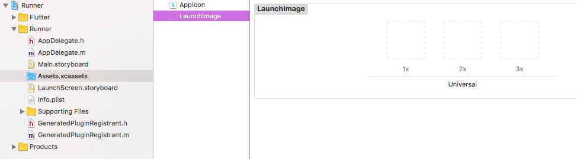

# Adding assets and images <!-- omit in toc -->

## 目录 <!-- omit in toc -->
- [Specifing assets](#specifing-assets)
- [Asset bunding](#asset-bunding)
- [Asset variants](#asset-variants)
- [Loading assets](#loading-assets)
  - [Loading text assets](#loading-text-assets)
  - [Loading images](#loading-images)
    - [Declaring resolution-aware image assets](#declaring-resolution-aware-image-assets)
    - [Loading images](#loading-images-1)
  - [Asset images in package dependencies](#asset-images-in-package-dependencies)
    - [Bunding of package assets](#bunding-of-package-assets)
- [Sharing assets with the underlying platform](#sharing-assets-with-the-underlying-platform)
  - [Loading Flutter assets in Android](#loading-flutter-assets-in-android)
  - [Loading Flutter assets in iOS](#loading-flutter-assets-in-ios)
  - [Loading iOS images in Flutter](#loading-ios-images-in-flutter)
- [Platform assets](#platform-assets)
  - [Updating the app icon](#updating-the-app-icon)
    - [Android](#android)
    - [iOS](#ios)
  - [Updating the launch screen](#updating-the-launch-screen)
    - [Android](#android-1)
    - [iOS](#ios-1)


`Flutter`程序同时包括代码和资源文件。一个资源是一个打包好，可以部署到程序之中的一个文件，并且在程序运行时可以访问。通常的资源类型包括静态数据（比如，`JSON`文件），配置文件，图标以及图片（`JPEG`，`WebP`，`GIF`，`PNG`，`BMP`以及`WBMP`）。

## Specifing assets

`Flutter`使用位于项目根目录下的`pubspec.yaml`文件来识别应用程序需要的资源文件。

下面是一个例子：

```dart
flutter:
  assets:
    - assets/my_icon.png
    - assets/background.png
```

如果要包含一个目录下的所有资源，可以指定这个目录名称，以`/`结尾：

```dart
flutter:
  assets:
    - assets/
```

注意到只有在这个目录下的文件才会被包括，如果想包含子目录下的文件，需要给每个目录创建一个配置。

## Asset bunding

`pubspec.yaml`文件内的`flutter`配置块内的`assets`子配置块用来指定应该被应用程序包含的资源文件。每个资源都被一个显式的路径指定（相对于`pubspec.yaml`文件）。资源文件申明的顺序并不重要，实际的目录名称也不重要（不一定非得命名成`assets`）。

在编译的时候，`Flutter`会把资源打包到一个特殊的归档中，这个归档称为`asset bundle`，可以在程序运行的时候被程序读取。

## Asset variants

编译的过程支持`asset variants`的方式：不同版本的资源可以在不同的环境下使用。当一个资源的路径在`pubspec.yaml`的`assets`模块中指定时，编译进程会在相邻的子目录中寻找相同名称的资源文件。这些文件也会被包含在`asset bundle`中。

比如，如果的应用程序目录下有如下的文件：

```bash
  .../pubspec.yaml
  .../graphics/my_icon.png
  .../graphics/background.png
  .../graphics/dark/background.png
  ...etc.
```

在你的`pubspec.yaml`文件里添加下面的资源：

```yaml
flutter:
  assets:
    - graphics/background.png
```
那么，`graphics/background.png`和`graphics/dark/background.png`都会被打包到`asset bundle`里去。前者被叫做`main asset`，后者称为`variant`。

如果只指定了`graphics`这个目录：

```yaml
flutter:
  assets:
    - graphics/
```
那么，`graphics/background.png`和`graphics/dark/background.png`也一样都会被打包到`asset bundle`里去。

`Flutter`使用`asset variant`来选择合适分辨率的图片。在未来，这个机制可以被拓展来适应不同的语言区域等等。

## Loading assets

应用程序可以通过`AssetBundle`对象来获取资源。

`AssetBundle`对象的两个主要的方法可以根据指定的键从`asset bundle`中加载文本资源（`loadString()`)以及图片资源（`load()`）。键映射为在`pubspec.yaml`文件中指定的资源路径。

### Loading text assets

每个`Flutter`程序有一个`rootBundle`对象来获取`main asset bundle`。可以通过`rootBundle`这个全局静态变量来加载资源文件，这个变量来自于`package:flutter/services.dart`。

然而，推荐使用当前`BuildContext`的`DefaultAssetBundle`来获取`AssetBundle`，而不是使用全局的`rootBundle`。this approach enables a parent widget to substitute a different AssetBundle at run time, which can be useful for localization or testing scenarios.

通常，你可以使用`DefaultAssetBundle.of()`来从应用程序的`rootBundle`中直接加载一个资源文件，比如一个JSON文件。

在控件的`context`之外，或者当`AssetBundle`句柄不可用的时候，你可以直接使用`rootBundle`来直接加载资源文件。比如：

```dart
import 'dart:async' show Future;
import 'package:flutter/services.dart' show rootBundle;

Future<String> loadAsset() async {
  return await rootBundle.loadString('assets/config.json');
}
```

### Loading images

`Flutter`可以根据当前的设备像素比来加载合适分辨率的图片。

#### Declaring resolution-aware image assets

`AssetImage`知道如何映射一个逻辑请求的资源文件到最靠近的设备像素比的文件。为了使得这种映射可以工作，资源文件应该被组织为一种特殊的目录结构：

```
  .../image.png
  .../Mx/image.png
  .../Nx/image.png
  ...etc.
```

这里`M`和`N`表示目录下图片的分辨率，也就是说指定了目录下的图片适合哪个设备像素比。

主资源文件被假设为对应分辨率1.0。比如，考虑到下面的资源文件：

```
  .../my_icon.png
  .../2.0x/my_icon.png
  .../3.0x/my_icon.png
```

在设备像素比为1.8的时候，会选择`.../2.0x/my_icon.png`文件。当设备的像素比为2.7的时候，会选择`.../2.0x/my_icon.png`.

如果图片的长和宽没有在`Image`控件中指定的时候，图片的分辨率会被用来放缩图片，使得图片可以用来占据和主文件相同大的屏幕控件。也就是说，如果如果`.../my_icon.png`是72px乘72px，那么`.../3.0x/my_icon.png`就应该是216px乘216px；但是如果场合宽如果没有被指定的化，它们都会被渲染成72px乘72px。

`pubspec.yaml`文件里的每一个`asset`栏的配置都应该对应一个真实的文件，主资源文件除外。如果主资源文件没有对应一个真是的文件，那么如果设备的分辨率低于最低分辨率的资源文件，最低的分辨率的那张图片就会被使用。即使主资源文件可以不存在，但是必须在`pubspec.yaml`文件中指定。

#### Loading images

可以在控件的`build`函数里面使用`AssetImage`类来加载图片。

比如，你的应用程序可以从上面申明的资源文件中加载一张背景图片：

```dart
Widget build(BuildContext context) {
  return Image(image: AssetImage('graphics/background.png'));
}
```

任何使用默认的`asset bundle`在加载图片的时候都会自动加载合适的分辨率。

### Asset images in package dependencies

为了从一个依赖的库中加载图片，这个库的名称必须提供给`AssetImage`。

比如，如果你的应用程序依赖于一个叫做`my_icons`的库，这个库包括下面的目录结构：

```
  .../pubspec.yaml
  .../icons/heart.png
  .../icons/1.5x/heart.png
  .../icons/2.0x/heart.png
  ...etc.
```

使用下面的方式来加载图片：

```dart
AssetImage('icons/heart.png', package: 'my_icons')
```

Assets used by the package itself should also be fetched using the package argument as above.


#### Bunding of package assets

如果需要的资源文件在`pubspec.yaml`中指定了，可以自动被应用程序打包。特别地，如果资源文件被这个库自己使用，那么必须要在`pubspec.yaml`中指定。

一个库可以选择把资源文件放到`lib/`目录下，这样可以不在`pubspec.yaml`中指定。在这种情况下，那些需要被打包的文件，应用程序需要在`pubspec.yaml`中指定哪些需要被包括。比如，一个叫做`fancy_backgrounds`的库可以有下面这些文件：

```
  .../lib/backgrounds/background1.png
  .../lib/backgrounds/background2.png
  .../lib/backgrounds/background3.png
```

比如，为了包括第一个文件，`pubspec.yaml`配置文件应该在`asset`栏这么指定：

```yaml
flutter:
  assets:
    - packages/fancy_backgrounds/backgrounds/background1.png
```
`lib/`目录是隐含的，不需要在资源路径中指明。

## Sharing assets with the underlying platform

`Flutter`资源文件可以被不同平台的代码使用，比如`Android`上的`AssetManager`以及`iOS`上的`NSBundle`。

### Loading Flutter assets in Android

在`Android`资源文件可以通过`AssetManager` API使用。
### Loading Flutter assets in iOS

### Loading iOS images in Flutter

## Platform assets

There are other occasions to work with assets in the platform projects directly. Below are two common cases where assets are used before the Flutter framework is loaded and running.


### Updating the app icon

更新`Flutter`应用程序的启动图标和更新原生`Android`和`iOS`程序的启动图标是一样的。

#### Android

在应用程序的根目录，导航到`../android/app/src/main/res`。不同的位图资源目录比如`mipmap-hdpi`等都以及有了占位的图片：`ic_launcher.png`。把这些图片换成你希望的资源文件即可。

> 注意：如果你重命名了`.png`文件，需要更新`AndroidMainfest.xml`文件里，`<application>`标签的`android:icon`属性。
> 
#### iOS

在应用程序的根目录，导航到`.../ios/Runnder`。里面的`Assets.xcassets/AppIcon.appiconset`目录已经包含了占位图片。把这些图片换成你希望的资源即可，注意不要更改文件名称。

### Updating the launch screen

Flutter also uses native platform mechanisms to draw transitional launch screens to your Flutter app while the Flutter framework loads. This launch screen persists until Flutter renders the first frame of your application.

#### Android

若要往应用程序中添加一个`splash screen`，导航到`../android/app/src/main`目录下。在`res/drawable/launch_background.xml`文件里进行配置。默认的模版提供了一个例子，添加一个图片在白色的屏幕中。

更多细节，见[添加一个`splash screen`和一个`launch screen`到`Android`程序中](https://flutter.dev/docs/development/ui/splash-screen/android-splash-screen)


#### iOS
若要添加一个图片到`splash screen`中，导航到`../ios/Runnder`。在`Assets.xcassets/LaunchImage.imageset`里，放入命名为`LaunchImage.png`,`LanuchImage@2x.png`以及`LaunchImage@3x.png`的图片。如果你使用不同的文件名，需要更新在同一个目录下的`Contents.json`文件。

你也可以在Xcode中完全定制化你的启动屏幕，打开`.../ios/Runnder.xcworkspace`, 导航到`Runnder/Runnder`,打开`Assets.xcassets`，并加入图片或者在`LaunchScfreen.storyboard`中做任何你想要做的定制。


