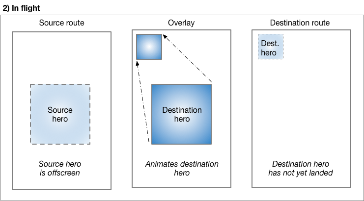

# Animations  <!-- omit in toc -->

## 目录  <!-- omit in toc -->

- [Animations overview](#animations-overview)
  - [Animation](#animation)
    - [addListener](#addlistener)
    - [addStatusListener](#addstatuslistener)
  - [AnimationController](#animationcontroller)
  - [Tweens](#tweens)
  - [Architecture](#architecture)
    - [Scheduler](#scheduler)
    - [Tickers](#tickers)
    - [Simulations](#simulations)
    - [Animatables](#animatables)
      - [Tweens](#tweens-1)
      - [Composing animatables](#composing-animatables)
    - [Curves](#curves)
    - [Animations](#animations)
      - [Composable animations](#composable-animations)
      - [Animation Controllers](#animation-controllers)
      - [Attaching animatables to animations](#attaching-animatables-to-animations)
- [Tutorial](#tutorial)
  - [Essential animation concepts and classes](#essential-animation-concepts-and-classes)
  - [Animation<double>](#animationdouble)
  - [CurvedAnimation](#curvedanimation)
  - [AnimationController](#animationcontroller-1)
  - [Tween](#tween)
    - [Tween.animate](#tweenanimate)
  - [Animation notifications](#animation-notifications)
- [Implicit animations](#implicit-animations)
  - [Implicit animations codelab](#implicit-animations-codelab)
    - [What are implicit animations?](#what-are-implicit-animations)
      - [Example: Fade-in text effect](#example-fade-in-text-effect)
      - [Example: Shape-shifting effect](#example-shape-shifting-effect)
- [Hero animations](#hero-animations)
  - [Basic structure of a hero animation](#basic-structure-of-a-hero-animation)
  - [Behind the scdenes](#behind-the-scdenes)
  - [Essential classes](#essential-classes)
  - [Standard hero animations](#standard-hero-animations)
    - [PhotoHero class](#photohero-class)
    - [HeroAnimation class](#heroanimation-class)
  - [Radial hero animations](#radial-hero-animations)
    - [Photo class](#photo-class)
    - [RadialExpansion class](#radialexpansion-class)
- [Staggered animations](#staggered-animations)

## Animations overview

`Flutter`的动画系统基于`Animation`对象。控件既可以通过监听动画值的变动，在它们的`build`函数中直接使用当前动画值，也可以使用这些动画作为传递给其它控件的更复杂动画的一部分。

### Animation

动画系统的最主要的部分是`Animation`类。一个动画代表了可以随时间变化的一个特定类型的值。绝大多数带动画效果的控件都会接收一个`Animation`对象作为参数，从这个对象中去监听和读取变化的数值。

#### addListener

当动画的值变化时，动画对象会通过`addListener`来通知所有的监听对象。典型地，一个监听动画的`State`对象会在自己的监听回调函数中调用`setState`函数来通知控件系统自己需要根据新的动画值来重建。

这个模式十分普遍，以至于有两个控件可以帮助我们在动画发生变化时重建控件：`AnimatedWidget`和`AnimatedBuilder`。前者对于无状态的动画控件最有用。为了使用`AnimatedWidget`，只要简单地继承它，并实现`build`函数即可。后者，`AnimatedBuilder`，对于更复杂控件最有用。为了使用`AnimatedBuilder`，只要构造一个控件，并把它传入`AnimatedBuilder`的`builder`函数中。

#### addStatusListener

动画对象同时也提供一个`AnimationStatus`对象，用来显示动画是如何随时间变化的。当动画的状态发生变化时，动画会通知`addStatusListener`添加的所有对象。通常，动画以`dismissed`状态开始，这表示处于动画的开端。比如，一个从0.0到1.0的动画，当动画值为0.0的时候位于`dismissed`状态。一个动画可能正向进行`forward`（比如从0.0到1.0），也可能反向进行`reverse`（比如从1.0到0.0）。最终，动画会到达终点，也就是到达`completed`状态。

### AnimationController

在创建动画之前，首先要创建一个`AnimationController`，它不仅本身是一个动画，也可以允许你来控制动画。比如，你可以让控制器把动画正向播放或者停止。你也可以使用一个物理模拟来快速播放动画。

一旦你创建了一个动画控制器，你可以开始基于它来创建其它的动画，比如你可以基于初始的动画来创建一个`ReverseAnimation`，类似地，你也可以创建一个`CurvedAnimation`，它的动画值由一个`curve`对象来调节。

### Tweens

为了使动画的值可以不在0.0到1.0之间，你可以使用一个`Tween<T>`对象，它可以在`begin`和`end`值之间进行差值。许多类型都有特定的`Tween`子类，可以提供特定类型的插值。比如，`ColorTween`可以对颜色进行插值。`RectTween`可以对矩形进行插值。你可以通过创建`Tween`的子类，并重载`lerp`函数来定义自己的插值。

对于`tween`来说，它只会定义如何在两个值之间进行插值。为了得到当前动画帧的正确的数值，你需要一个动画对象来确定当前的状态。有两种方式可以结合`tween`和一个动画对象来得到正确的数值：

1. 你可以在动画的当前值`evaluate`。这种方式对于已经监听了动画的控件是十分有用的，因此当动画值变化时可以进行重建。
2. 你可以基于动画进行`animate`。相比于返回一个单独的值，动画对象会返回一个新的动画对象来对`tween`进行插值。这种方式对于你想创建一个新的动画对象给另一个控件是很有用的，

### Architecture

动画实际上是建立在一些基础之上的。

#### Scheduler

`SchedulerBing`是一个单例来暴露`Flutter`的事件规划单元。

在这个讨论中，关键点是帧回调。每次一帧需要在屏幕上展示时，`Flutter`引擎会触发一个`begin frame`的回调，事件规划器会通过`scheduleFrameCallback()`回调并行传递给所有监听的对象。所有的这些回调都会给予相同的时间来执行。正是因为如此，这些回调触发的动画都会是严格同步的，即使它们只需要几毫秒去执行。

#### Tickers

`Ticker` 类作为事件规划器的`scheduleFrameCallback()`回调的钩子，可以在每次计时跳动时触发这个回调。

一个计时器可以被启动和停止。当启动时，他返回一个`Future`，这个对象在计时器被停止时返回。

对于每一次计时，计时器提供了一个回调函数，并提供从计时开始到目前为止过去的时间。

因为计时器总是给相对于第一次计时的时间，所以所有的计时器都是同步的。如果你在两帧之间启动了三个计时器，它们都会被同步成相同的开始时间，并在之后步调一致。

#### Simulations

`Simulation`抽象类映射一个相对时间值（相对于第一次计时过去的时间）到一个double数值，并且在计时结束时会有提示。

原则上，模拟器是无状态的，但是实际上，一些模拟器会不可逆转地改变状态。

现在有很多不同效果的模拟类的概念实现。

#### Animatables

`Animatable`抽象类把一个double数值映射到一个特定的类型。

可动画类是无状态和不可改变的。

##### Tweens

`Tween` 抽像类映射一个double数值（一般是从0.0到1.0之间）到一个特定的类型（比如，一个颜色，或者另一个double数值）。它是`Animatable`的。

`Tween`有一个输出类型的标记(T)，一个开始数值，一个结束数值，以及在开始和结束数值之间进行插值(lerp)的方法。

`Tween`类是无状态且不可改变的。

##### Composing animatables

传递一个`Animatable<double>` (the parent)给一个`Animatable`的`chain()`函数可以创建一个新的动画子类，这个子类会把父类的映射传递给子类。

#### Curves

`Curve` 子类映射double数值（通常是0.0到1.0之间）到0.0-1.0之间。

曲线类是无状态且不可改变的。

#### Animations

`Animation`抽象类提供了一个给定类型，一个动画方向和状态，一个监听接口来注册回调。

一些动画的子类有不会改变的类型值（`KAlwaysCompleteAnimation, kAlwayDismissedAnimation, kAlwaysStoppedAnimation`）。对这些类进行回调注册是无效的，因为回调不会被调用。

`Animation<double>`这个类是特殊的，因此它可以被用来代表0.0-1.0之间的均匀分布，这个类可以作为`Curve`以及`Tween`类的输入，以及一些动画的子类。

一些动画的子类是无状态的，只是传递监听者到它们的父类；另一些动画子类是有状态的。

##### Composable animations

绝大多数动画子类都有一个显示的“父类”，即`Animation<double>`。它们都是被父类驱动的。

`CurvedAnimation`子类接收一个`Animation<double>`父类，并且几个曲线类作为输入，并且使用父类的值作为曲线的输入，最终得到输出。`CurvedAnimation`是不可改变和无状态的。

`ReverseAnimation`子类接收一个`Animation<double>`类作为父类，并且回转动画的所有值。它假设父类使用一个0.0-1.0之间的均匀分布，并且返回一个1.0-0.0之间的分布。父类动画的状态和方向也同时被逆转。`ReverseAnimation`是不可改变和无状态的。

`ProxyAnimation` 子类接收一个`Animation<double>`类作为父类，并且只是执行父类的当前状态，然而，父类是可改变的。

`TrainHoppingAnimation`子类接收两个父类，并且当两个父类的动画值相交时，交换两个父类。

##### Animation Controllers

`AnimationController`是一个有状态的`Animation<double>`对象，使用一个`Ticker`来给予自己生命。它可以被开始和结束。在每个计时的时候，它接收从开始到现在已经过去的时间，并把它传给`Simulation`(模拟器)来获得一个动画值。如果模拟器报告时间已经结束，那么控制器就会把自己停止。

动画控制器可以传如一个动画值的范围，以及一个时间长度。

在简单的情况下（使用`forward(), reverse(), play(), or resume()`)，动画控制器只是简单地在给定的时间内，对动画值范围内进行线性插值。

当使用`repeat()`函数的时候，控制器在给定的时间内，对给定的范围进行线性插值，但是不会停止。

当使用`animateTo()`函数的时候，控制器在给定的时间内，对给定的范围进行线性插值，插值到给定的目标区间。如果没有传入时间，会使用默认的时间。

当使用`fling()`函数的时候，控制器会使用一个力来创建一个特殊的模拟。

当时用`animateWith()`函数的时候，传入的模拟方式会用来驱动控制器。

以上这些函数都会返回计时器提供的future对象，当控制器停止时会返回值。

##### Attaching animatables to animations

传递`Animation<double>`（父类）给一个`Animatable`的`animate()`函数创建了一个新的动画子类，这个子类的行为和`Animatable`一致，但是是被父类驱动的。

## Tutorial

### Essential animation concepts and classes

> 重点：
> `Animation`，动画类的核心，用来在动画执行过程中进行插值。
> 一个`Animation`对象知道当前动画的状态（比如，动画什么时候开始、结束、正向或反向执行），但是不知道屏幕上出现了什么东西。
> `AnimationController`类管理`Animation`类。
> `CurvedAnimation`类定义非线性的动画。
> `Tween`类对数据进行插值
> 使用监听器和状态监听器来监控动画的状态变化。


### Animation<double>

在`Flutter`中，一个动画对象对UI一无所知。`Animation`是抽象的类，可以知道当前的动画值以及状态。一个普遍使用的动画类型是`Animation<double>`。

一个`Animation`对象按顺序生成一个范围内的数值的插值。输出的序列可以是线性的、非线性的、跳跃的，或者任何你可以生成的序列。根据`Animation`是如何控制的，动画可以被反向播放，甚至在播放过程中改变播放方向。

`Animation`可以插值除了`double`类型的类型，比如，`Animation<Color>`或者`Animation<Size>`。

一个动画对象有状态属性，属性值可以从`.value`成员变量中读取。

一个`Animation`对象不知道`build()`函数里的绘制逻辑。

### CurvedAnimation

一个`CurvedAnimation`把动画过程定义为一个非线性的曲线。

```dart
animation = CurvedAnimation(parent: controller, curve: Curves.easeIn);
```

> 注意：
> `Curves`类定义了许多常用的曲线，或者你可以创建自己的曲线。比如：
```dart
import `dart:math`;

class ShakeCurve extends Curve {
  @override
  double transform(double t) => sin(t * pi * 2);
}
```
> 查阅文档可以得到一个完整的曲线列表（带可视化预览）。

`CurvedAnimation`和`AnimationController`都是`Animation<double>`类型，所以你可以内部交换进行传递。`CurvedAnimation`包裹了它要改变的对象——你不需要继承`AnimationController`类来实现一个曲线。

### AnimationController

`AnimationController`是一个特殊的`Animation`对象，当硬件准备好绘制新帧的时候会生成一个新的动画值。默认下，`AnimationController`在一个给定的时间内，线性地生成0.0到1.0之间的插值。比如，下面的代码生成了一个动画对象，但是还没开始执行：

```dart
controller = AnimationController(duration: const Duration(seconds: 2), vsync: this);
```

`AnimationController`继承自`Animation<double>`，所以它可以用于任何需要`Animation`对象的地方。然而，`AnimationController`包含额外的来控制动画的方法。比如，你可以用`.forward()`方法来开始执行一个动画。生成的动画值是和屏幕刷新匹配的，所以典型地，每秒可以生成60个数字。在每个数字生成之后，每个动画对象会调用监听它的对象。为了给每一个子控件创建一个自定义的播放列表，见`RepaintBoundary`。

创建`AnimationController`的时候，你传入了一个`vsync`参数。这个参数用来防止后台动画消耗了大量的资源。你可以使用你的有状态的控件作为vsync，只要把`SingleTickerProviderStateMixin`加入到类定义中即可。你可以参考在Github的[例子](https://github.com/flutter/website/tree/master/examples/animation/animate1/lib/main.dart)。

> 在一些情况下，一个位置可能超过`AnimationController`的0.0-1.0的范围。比如，`fling()`函数允许你提供一个速度、力量来获得一个位置。这个位置可以是任何值，因此可以超出0.0到1.0的范围。

> 一个`CurvedAnimation`也可能超出0.0到1.0的范围，即使`AnimationController`不会。取决于选择的曲线，`CurvedAnimation`的输出可能比输入有更大的范围。比如，橡皮筋曲线会很容易超出或是小于默认的范围。

### Tween

默认情况下，`AnimationController`对象的范围是从0.0到1.0之间。入股你需要一个不同数据类型的不同范围，可以使用`Tween`。比如，下面的`Tween`从-200.0变化到0.0:

```dart
tween = Tween<double>(begin: -200, end: 0);
```

一个`Tween`对象是无状态的，并且只接收begin和end参数。这个对象的唯一工作就是定义从输入范围到输出范围的映射。

`Tween`继承自`Animatable<T>`，而非`Animation<T>`。一个`Animatable`对象，类似于`Animation`对象，但是不用非得输出double值。比如，`ColorTween`定义了在两个颜色之间的插值。

```dart
colorTween = ColorTween(begin: Colors.transparent, end: Colors.black54);
```

一个`Tween`对象并不保存任何状态。相反，它提供一个`evaluate(Animation<double> animation)`方法来对动画的当前值进行函数映射。动画的当前值可以在`.value`方法中获取。这个计算函数还会做一些清理工作，比如确保当动画值是0.0和1.0时，相应的begin和end值会被返回。

#### Tween.animate

使用`Tween`对象的时候，调用它的`animate()`函数，传入动画控制器对象。比如，下面的代码在500ms之内生成0到255之间的整数。

```dart
AnimationController controller = AnimationController(
  duration: const Duration(milliseconds: 500),
  vsync: this,
);
Animation<int> alpha = IntTween(begin: 0, end: 255).animate(controller);
```

> `animate()`函数返回一个`Animation`对象，而不是`Animatable`。

下面的例子展示了一个控制器，一个曲线、和一个`Tween`:

```dart
AnimationController controller = AnimationController(
  duration: const Duration(milliseconds: 500),
  vsync: this
);
final Animation curve = CurvedAnimation(parent: controller, curve: Curves.easeOut);
Animation<int> alpha = IntTween(begin: 0, end: 255).animate(curve);
```

### Animation notifications

一个`Animation`对象可以有`Listener`和`StatusListener`，在`addListener()`和`addStatusListener()`中定义。当动画值改变的时候，`Listener`就会被调用。最常见的监听者的行为就是去调用`setState()`函数来触发控件重建。

## Implicit animations

使用`Flutter`的动画库，你可以为你的UI控件添加动画、创建视觉效果。动画库的一部分是各种各样的管理动画的控件，这些控件被称为隐式的动画，或者隐式动画控件，因此这些控件都是从`ImplicitlyAnimatedWidget`类实现而来的。下面提供了许多种资源来学习隐式动画控件。

### Implicit animations codelab

这个代码实验室包含下面的材料：

* 使用`AnimatedOpacity`来创建一个淡入的效果
* 使用`AnimatedContainer`来创建大小、颜色以及边缘留白大小的转换
* 概述隐性动画控件，以及使用它们的方式

#### What are implicit animations?

在`Flutter`中，有一类的控件可以为你管理动画。这些控件被称为隐式控件。在这些控件里，你可以通过设置一个目标值来动画一个控件的属性；当目标值发生变化时，控件会从旧的值动态改变到新的值。通过这种方式，隐式控件做了控制动画的方方面面和使用方便性的权衡——它们负责管理动画效果，而使用者无需担心。

##### Example: Fade-in text effect

下面的例子显示了如何给现有的界面添加一个淡入效果，通过使用一个叫做`AnimatedOpacity`的隐式动画控件。下面是初始的不带动画的代码，包含

* 一个碗的图片
* 一个`show details`的按钮，按钮被点击时淡入效果显示描述碗的文字


```dart
import 'package:flutter/material.dart';

const owl_url = 'https://raw.githubusercontent.com/flutter/website/master/src/images/owl.jpg';

class FadeInDemo extends StatefulWidget {
  _FadeInDemoState createState() => _FadeInDemoState();
}

class _FadeInDemoState extends State<FadeInDemo> {
  double opacity = 0.0;

  @override
  Widget build(BuildContext context) {
    return Column(
      children: <Widget>[
        Image.network(owl_url),
        MaterialButton(
          child: Text(
            'Show details',
            style: TextStyle(
              color: Colors.blueAccent,
            ),
          ),
          onPressed: () => setState(() {
            opacity = 1.0;
          }),
        ),
        AnimatedOpacity(
          opacity: opacity,
          duration: const Duration(seconds: 2),
          child: Column(
            children: <Widget>[
              Text('Type: Owl'),
              Text('Age: 39'),
              Text('Employment: None'),
            ],
          ),
        )
      ],
    );
  }
}

class MyApp extends StatelessWidget {
  @override
  Widget build(BuildContext context) {
    return MaterialApp(
      debugShowCheckedModeBanner: false,
      home: Scaffold(
        body: Center(
          child: FadeInDemo(),
        ),
      ),
    );
  }
}

Future<void> main() async {
  runApp(
    MyApp(),
  );
}
```

##### Example: Shape-shifting effect

下面的例子展示了如何使用`AnimatedContainer`控件来同时动画多个属性。

```dart
import 'package:flutter/material.dart';
import 'dart:math';

const _duration = Duration(milliseconds: 400);

double randomBorderRadius() {
  return Random().nextDouble() * 64;
}

double randomMargin() {
  return Random().nextDouble() * 64;
}

Color randomColor() {
  return Color(0xFFFFFFFF & Random().nextInt(0xFFFFFFFF));
}

class AnimatedContainerDemo extends StatefulWidget {
  _AnimatedContainerDemoState createState() => _AnimatedContainerDemoState();
}

class _AnimatedContainerDemoState extends State<AnimatedContainerDemo> {
  Color color;
  double borderRadius;
  double margin;

  @override
  void initState() {
    super.initState();

    color = Colors.deepPurple;
    borderRadius = randomBorderRadius();
    margin = randomMargin();
  }

  void change() {
    setState(() {
      color = randomColor();
      borderRadius = randomBorderRadius();
      margin = randomMargin();
    });
  }

  @override
  Widget build(BuildContext context) {
    return Scaffold(
      body: Center(
        child: Column(
          children: <Widget>[
            SizedBox(
              width: 128,
              height: 128,
              child: AnimatedContainer(
                margin: EdgeInsets.all(margin),
                decoration: BoxDecoration(
                  color: color,
                  borderRadius: BorderRadius.circular(borderRadius),
                ),
                duration: _duration,
                curve: Curves.easeInOutBack,
              ),
            ),
            MaterialButton(
              color: Theme.of(context).primaryColor,
              child: Text(
                'change',
                style: TextStyle(
                  color: Colors.white,
                ),
              ),
              onPressed: () => change(),
            ),
          ],
        ),
      ),
    );
  }
}

class MyApp extends StatelessWidget {
  @override
  Widget build(BuildContext context) {
    return MaterialApp(
      debugShowCheckedModeBanner: false,
      home: AnimatedContainerDemo(),
    );
  }
}

Future<void> main() async {
  runApp(
    MyApp()
  ); 
}
```

## Hero animations

你可能已经见过主角动画很多次了。比如，一个展示了很多待售商品的页面，选择一个商品后会进入一个新的页面，包含更详细的信息，以及一个购买的按钮。图片从一个屏幕飞入另一个屏幕就叫做主角动画，尽管同样的动画有时会被称为共享元素转换`shared element transition`。

### Basic structure of a hero animation

主角动画有下面的结构：

1. 定义一个初始的`Hero`控件，叫做`source hero`。这个控件指定它的图形表示（一般是一个图片），以及一个识别的标签。这个控件在`source route`定义的控件树中。
2. 定义一个结束`Hero`控件，叫做`destination hero`。这个控件也需要指定它的图形表示，以及一个和`source hero`一样的标签。注意，两个`hero`一定要有相同的标签，这个标签通常可以表示底层的数据。为了最好的效果，两个`hero`应该要有相同的虚拟控件树。
3. 创建一个包含`destination hero`的路由。这个路由定义了动画结束时的控件树。
4. 通过把`destination route`推入导航中来触发`hero animation`。导航条推入和弹出的操作触发了动画的发生。

`Flutter`会计算动画中主角的边界（对大小和位置进行插值），重叠在一起进行播放。

下一个小节会对`Flutter`执行的过程做详细的描述。

### Behind the scdenes

下面描述了`Flutter`是怎么从一个路由转换到另一个的


在开始路由切换之前，`source hero`在开始路由中进行等待，结束路由开不存在，`overlay`也不存在。


当把路由推入导航栈中时，触发动画。在t=0.0时，`Flutter`做了下面这些：

* 在屏幕后面计算结束主角的路径。现在`Flutter`知道了主角结束的位置。
* 把结束主角放到overlay中，位置和大小和初始主角一致。添加一个主角到overlay中改变了它的Z-order，所以它会出现在所有的路由之上。



当主角进行转换时，它的矩形框使用`Tween<Rect>`进行动画模拟，这个在主角的`createRectTween`属性中进行设置。默认情况下，Flutter使用一个`MaterialRectArcTween`的实例，这个会沿着一个曲线对矩形框的对角顶点进行动画插值。


当动画结束时：

* Flutter把主角控件从overlay 路由中移到结束路由中。现在overlay路由就变成空的了。
* 结束主角现在出现在结束路由的最终位置上。
* 初始主角被恢复到初始路由上。

弹出路由执行的是同样的过程，会把主角动画移动到原始路由里面的位置和大小。

### Essential classes

`Hero`

这个控件从初始路由中转移到结束路由里。

`Inkwell`

定义当用户点击主角时会发生什么。一般会创建一个新的路由并压如导航栈中。

`Navigator`

管理路由栈。从栈中压入或是弹出一个路由会触发动画。

`Route`

定义一个页面。

### Standard hero animations

#### PhotoHero class

自定义的`PhotoHero`类用来管理`hero`以及它的大小、图片和点击的行为。这个类的控件树如下图所示：


下面是代码：

```dart
class PhotoHero extends StatelessWidget {
  class PhotoHero({Key key, this.photo, this.onTap, this.width}): super(key: key);

  final String photo;
  final VoidCallback onTap;
  final double width;

  Widegt build(BuildContext) {
    return SizedBox(
      width: width,
      child: Hero(
        tag: photo,
        child: Material(
          color: Colors.transparent,
          child: InkWell(
            onTap: onTap,
            child: Image.asset(
              photo,
              fit: BoxFit.contain,
            ),
          ),
        ),
      ),
    );
  }
}
```
关键信息：

* 当主角控件被加入到`MaterialApp`控件的home属性中的时候，初始路由就被隐式地压如导航栈中了。
* 使用`InkWell`来包裹图片控件，使得对图片添加点击时间变得容易了。
* 把`Material`控件设置为透明可以让图片在转换时可以从背景中跳出。
* `SizedBox`类用来指定初始和结束路由中的主角大小。
* 设置图片的fit属性为`BoxFit.contain`，可以确保图片在动画过程中可以在不改变长宽比的情况下尽可能大。

#### HeroAnimation class

`HeroAnimation`类创建初始和结束路由，并且设置动画。

```dart
class HeroAnimation extends StatelessWidget {
  Widget build(BuildContext context) {
    timeDilation = 5.0; // 1.0 means normal animation speed.

    return Scaffold(
      appBar: AppBar(
        title: const Text('Basic Hero Animation'),
      ),
      body: Center(
        child: PhotoHero(
          photo: 'images/flippers-alpha.png',
          width: 300.0,
          onTap: () {
            Navigator.of(context).push(
              MaterialPageRoute<void>(
                builder: (BuildContext context) {
                  return Scaffold(
                    appBar: AppBar(
                      title: const Text('Flipper Page'),
                    ),
                    body: Container(
                      color: Colors.lightBlueAccent,
                      padding: const EdgeInsets.all(16.0),
                      alignment: Alignment.topLeft,
                      child: PhotoHero(
                        photo: 'images/flippers-alpha.png',
                        width: 100.0,
                        onTap: () {
                          Navigator.of(context).pop();
                        },
                      ),
                    ),
                  );
                },
              ),
            );
          },
        ),
      ),
    );
  }
}
```

关键信息：

* 当用户点击初始主角时，通过`MaterialPageRoute`来创建结束路由，并压入导航栈中
* 结束路由的`Container`控件把`PhotoHero`控件放置到了左上角。
* 可以使用`timeDilation`属性在debug的时候把动画减慢。


### Radial hero animations

在把一个主角从一个路由转移到另一个路由时，主角的形状从圆形转变为矩形。为了实现这个效果，需要把两种裁剪形状的相交进行动画化：一个圆形、一个方形。在动画进程中，圆形裁剪器（包括图片)的半径从`minRadius`缩放到`maxRadius`，而矩形裁剪器维持大小不变。与此同时，图片从原始路由的位置转换到结束路由的位置。

下面这个图显示了在最开始以及最后的裁剪图片：


#### Photo class

```dart
class Photo extends StatelessWidget {
  Photo({ Key key, this.photo, this.color, this.onTap }) : super(key: key);

  final String photo;
  final Color color;
  final VoidCallback onTap;

  Widget build(BuildContext context) {
    return Material(
      // Slightly opaque color appears where the image has transparency.
      color: Theme.of(context).primaryColor.withOpacity(0.25),
      child: InkWell(
        onTap: onTap,
        child: Image.asset(
            photo,
            fit: BoxFit.contain,
          )
      ),
    );
  }
}
```

#### RadialExpansion class

`RadialExpansion`类的控件树如下：


代码如下：

```dart
class RadialExpansion extends StatelessWidget {
  RadialExpansion({
    Key key,
    this.maxRadius,
    this.child,
  }) : clipRectSize = 2.0 * (maxRadius / math.sqrt2), super(key: key);

  final double maxRadius;
  final clipRectSize;
  final Widget child;

  @override
  Widget build(BuildContex context) {
    return ClipOval(
      child: Center(
        child: SizeBox(
          width: clipRectSize,
          height: clipRectSize,
          child: ClipRect(
            child: child, // photo
          ),
        ),
      ),
    );
  })
}
```

## Staggered animations
