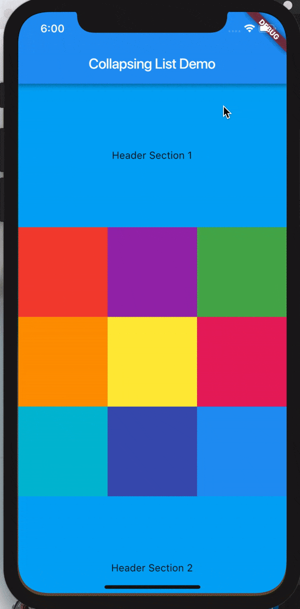
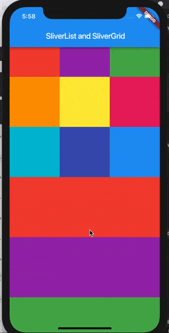
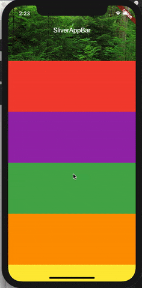
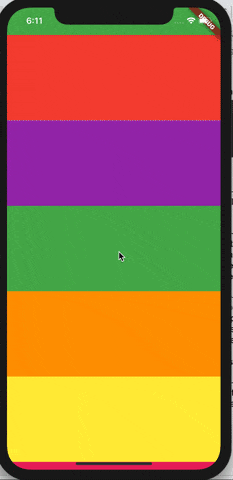

# Advanced UI

## Silvers

> Do fancy scrolling tecniques in your mobile app with Flutter.

一般情况下`ListView`和`GridView`可以对内容进行滚动。但是如果你想要像下面这样的高级滚动特性：






就请继续往下看。。。

### What's Silver and Why do I want it?

一个`silver`是屏幕是那个一块可以滚动的区域。就这么简单！实际上，像`ListView`和`GridView`都是使用`Sliver`进行实现的。你可以把`sliver`当成一个底层的接口，提供了实现可滚动区域更精细的控制。因为`sliver`可以在滚动的时候动态构造展示的内容，这对于展示很大的列表很有用。

你可能在下面这些情况下想使用这个额外的滚动控制：

* 想要一个非标准展示效果的标题栏（滚动的时候消失，改变大小或者改变颜色）。
* 想要同时滚动一个列表以及一个网格。
* 做一些奇怪的效果，比如收起带标题的列表。

### How do I use it?

所有的这些`sliver`控件都需要位于`CustomScrollView`里面。剩下的就需要你自己去结合你的`sliver list`来创建自定义的可滚动区域。你可以通过把`SilverList`放到一个`CustomScrollView`里面，并且不需要做其它任何事情，就可以重新实现一个`ListView`。

#### SilverList

`SilverList`接收一个`delegate`参数用来指定滚动的列表。你可以使用`SilverChildListDelegate`来显示指定列表，或者也可以通过`SilverChildBuilderDelegate`来动态构造这个列表，后者的效率更高。

```dart
// Explicit list of children. No efficiency savings here since
// the children are already constructed

SilverList(
  delegate: SliverChildListDelegate(
    [
      Container(color: Colors.red, height: 150.0),
      Container(color: Colors.purple, height: 150.0),
      Container(color: Colors.green, height: 150.0),
    ],
  ),
);

// This builds an infinite scrollable list of differently
// colored containers
SilverList(
  delegate: SilverChildBuilderDelegate(
  (BuildContext context, int index) {
    // To convert this infinite list to a list with three items
    // uncomment the following line:
    // if (index > 3) return null;
    return Container(color: getRandomColor(), height: 150);
  },
  // or uncomment the following line: 
  // childCount: 3,
  ),
);
```

#### SilverGrid
`SilverGrid`同样可以想`SilverList`一样，通过一个`delegate`来指定子控件，或者一个显式的列表。但是对于网格的垂直方向，有一些额外的格式可以指定。下面是一些使用网格布局的方式：

1. 使用`Count`构造函数来指定元素个数，比如使用`SilverGrid.count(children: scrollItems, crossAxisCount: 4)`来指定水平方向上的元素个数为4个。
2. 使用`Extent`构造函数来指定元素的最大宽度。这对于网格大小不同的情况最有用。`SliverGrid.Extent(children: scrollItems, maxCrossAxisExtent: 90.0)`
3. 默认构造函数，传入一个显式的`gridDelegate`参数：

```dart
// re-implementing the above SliverGrid.count example:
SilverGrid(
  gridDelegate: SilverGridDelegateWithFixedCrossAxisCount(
    crossAxisCount: 4,
  ),
  delegate: SilverChildBuilderDelegate(
    (BuildContext context, int index) {
      return new Container(
        color: randomColor(),
        height: 150.0
      );
    },
  ),
);
```

#### SilverAppBar
如何制作一个绚丽的可收缩的标题栏呢？秘密在于同时设定`flexibleSpace`和`expandedHeight`参数。



下面是代码：

```dart
CustomScrollView(
  slivers: <Widget>[
    SilverAppBar(
      title: Text('SilverAppBar'),
      backgroundColor: Colors.green,
      expandedHeight: 200.0,
      flexibleSpace: FlexibleSpaceBar(
        background: Image.asset('assets/forest.jpg', fit: BoxFit.cover),
      ),
    ),
    SliverFixedExtentList(
      itemExtent: 150.0,
      delegate: SilverChildListDelegate(
        Container(color: Colors.red),
        Container(color: Colors.purple),
        Container(color: Colors.green),
        Container(color: Colors.orange),
        Container(color: Colors.yellow),
        Container(color: Colors.pink),
      ),
    ),
  ],
);
```
你还可以在`SilverAppBar`上添加额外的自定义参数，比如设置`floating`参数为`true`，使得往下滚动时，标题栏重新出现。



当你同时设置`snap`和`floating`参数时，你可以在下滑的时候把标题栏`snap back`到视图中。

## Gestures
