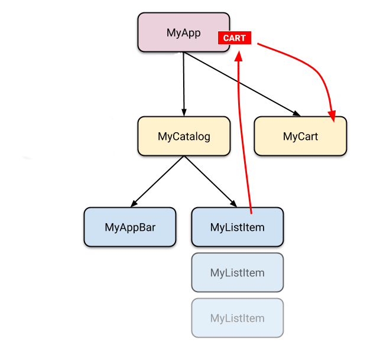

# Data & backend <!-- omit in toc -->

## 目录  <!-- omit in toc -->
- [State management](#state-management)
  - [Start thinking declaratively](#start-thinking-declaratively)
  - [Differentiate between ephemeral state and app state](#differentiate-between-ephemeral-state-and-app-state)
  - [Ephemeral state](#ephemeral-state)
  - [App state](#app-state)
  - [There is no clear-cut rule](#there-is-no-clear-cut-rule)
  - [Simple app state management](#simple-app-state-management)
    - [Lifting state up](#lifting-state-up)
    - [Accessing the state](#accessing-the-state)
      - [ChangeNotifier](#changenotifier)
      - [ChangeNotifierProvider](#changenotifierprovider)
      - [Consumer](#consumer)
      - [Provider.of](#providerof)
  - [List of state management approaches](#list-of-state-management-approaches)
- [Networking & http](#networking--http)
  - [Cross-platform http networking](#cross-platform-http-networking)
  - [Platform notes](#platform-notes)
    - [Android](#android)
  - [MacOS](#macos)
  - [Samples](#samples)
    - [Fetch data from the internet](#fetch-data-from-the-internet)
      - [Add the `http` package](#add-the-http-package)
    - [Parse JSON in the background](#parse-json-in-the-background)
      - [Move work to a separate isolate](#move-work-to-a-separate-isolate)
- [JSON and serialization](#json-and-serialization)
  - [Which JSON serialization nethod is right for me?](#which-json-serialization-nethod-is-right-for-me)
    - [Use manual serialization for smaller projects](#use-manual-serialization-for-smaller-projects)
    - [Use code generation for medium to large projects](#use-code-generation-for-medium-to-large-projects)
  - [Is there a GSON/Jackson/Moshi equivalent in Flutter?](#is-there-a-gsonjacksonmoshi-equivalent-in-flutter)
  - [Serializing JSON manually using dart:convert](#serializing-json-manually-using-dartconvert)
    - [Serializing JSON inline](#serializing-json-inline)
    - [Serializing JSON inside model classes](#serializing-json-inside-model-classes)
  - [Serializing JSON using code generation libraries](#serializing-json-using-code-generation-libraries)
    - [Setting up json_serializable in a project](#setting-up-json_serializable-in-a-project)
    - [Creating model classes the json_serializable way](#creating-model-classes-the-json_serializable-way)
    - [Running the code generation utility](#running-the-code-generation-utility)
    - [Consuming json_serializable models](#consuming-json_serializable-models)
  - [Generating code for nested classes](#generating-code-for-nested-classes)
- [Firebase](#firebase)


## State management


当你探索Flutter的时候，会遇到在不同屏幕之间共享状态的需求。有许多种方式可以实现这个需求。

下面会介绍如何在Flutter应用程序种处理状态的基础。

### Start thinking declaratively

Flutter是*申明式*的。这意味这Flutter创建用户界面来反应当前的应用状态：


当你的应用程序发生改变时（比如，用户切换了屏幕上的一个开关），你改变应用的状态，并且触发用户界面的重绘。不需要显式地让那个UI自己改变（像调用`widget.setText` )——你只要改变状态，UI就会从新开始重绘。

### Differentiate between ephemeral state and app state

宽泛来说，应用的状态是应用运行时所有存在内存中的变量，包括应用程序的资源文件，UI的各种变量，动画状态，纹理，字体等等。尽管这种宽泛的定义是有效的，但是对于搭建一个应用程序来说并不是十分有用。

首先你不需要管理某些状态（比如纹理），框架会替你进行管理。所以一个更有用状态定义是：应用的状态指的是任意时候，重建UI所需要的所有数据。其次，你需要管理的状态可以被分成两种类型：短期状态（`ephemeral`）和应用状态（`app state`）。

### Ephemeral state
短期状态（有时候又被称为UI状态或是局部状态），是你只会在一个单独的控件中包含的状态。下面是一些例子：

* `PageView`控件中的当前页面
* 一个复杂的动画中的当前进度
* `BottomNavigationBar`中的当前选择页

其它控件树很少需要获取这类状态。也没有需要序列化这个控件的需求，并且这个状态并不会以多种方式改变。

也就是说，这类的状态不需要使用状态管理技术来管理（比如`ScopedModel`、`Redux`等）。你所需要的只是一个带状态的控件。

下面展示了一个底部导航条的当前选择项是如何存储在`_MyHomePageState`类的`_index`字段中的。在这个例子中，`_index`就是一个短期状态。

```dart
class MyHomePage extends StatefulWidget {
  @override
  _MyHomePageState createState() => _MyHomepageState();
}

class _MyHomepageState extends State<MyHomepage> {
  int _index = 0;

  @override
  Widget build(BuildContext context) {
    return BottomNavigationBar(
      currentIndex: _index,
      onTap: (newIndex) {
        setState(
          () {
            _index = newIndex;
          }
        );
      },
      // ... items ...
    );
  }
}
```

这里，使用`setState()`以及一个在带状态控件内的字段是十分自然的。应用的其它部分不会需要获取`_index`的值。这个值只会在`MyHomepage`控件中改变。当用户关闭并重启应用，你也不在乎当前选择页面被重置了。

### App state

不是短暂的状态，需要在应用程序的不同组件间共享的状态，你希望能够在不同会话中保持的状态，被称为应用状态（有时候叫做共享状态）。

应用状态的例子包括：

* 用户偏好设置
* 登陆信息
* 社交应用里面的通知
* 网购应用中的购物车
* 新闻应用中的已读/未读状态

为了管理应用状态，你需要调研你的可选方法。你的选择决定于你的应用程序的复杂性和自我特性，你的团队之前的经验，以及其它许多方面。
请继续往下阅读。

### There is no clear-cut rule

确切地说，你可以使用`State`和`setState()`来管理应用中的所有状态。实际上，Flutter团队在许多简单的例子中就是这么做的e。

但是也有其它的方式。比如，你可以根据你的特定应用来决定——比如，底部导航条中的选择项不是一个短暂状态。你可能需要在控件外部来改变这个状态，在不同的会话中保持状态等等。在这种情况下，`_index`变量就是一个应用状态。

没有一个一刀切的，通用的规则来分辨一个特定的变量是短暂状态还是应用状态。有些时候，你可以把种状态重构称另一种。比如，你可能最开使觉得一个变量一定是一个短暂变量，但是当你的应用程序的功能逐渐增加时，它可能会变成一个应用变量。

基于这种原因，下面的图表可以作为一个粗略的决策参考：


当Dan Abramov被要求对比React的setState和Redux的store时，它回复到：

> "The rule of thumb is: [Do whatever is less awkward.](https://github.com/reduxjs/redux/issues/1287#issuecomment-175351978)

总之，在Flutter应用程序中有两种状态。`Ephemeral state`可以使用`State`和`setState()`来实现，并且通常是控件內可见的。第二中状态是应用状态。如何区分两种状态需要根据你自己的偏好以及应用的复杂性。

### Simple app state management


为了显示如何使用`provider`包来进行状态管理，考虑实现下面这个简单的应用。

这个应用有两个独立的页面：一个商品目录，一个购物车。下面是应用树：


下面问题来了：如何知道商品是否已经位于购物车呢？

#### Lifting state up

在Flutter，把状态提升到使用这个状态的控件之上是有意义的。

为什么呢？在像Flutter一样的申明式框架中，如果你想要改变UI，你必须去重新创建控件。所以，在Flutter框架下，你必须调用控件的构造函数来改变UI，此时控件还不存在，所以状态必须保存在使用这个状态的控件之上。

在这个例子中，商品状态是保存在应用程序中的，当它发生改变是时，会重建购物车。因此购物车是不需要考虑状态的生命周期——它只会展示传递给它的商品。当状态改变时，旧的购物车被销毁，会被一个新的购物车替换。



这也是为什呢我们说控件是不可改变的。它们并不改变——只会被替换。

既然我们知道了购物车的状态放在哪里，让我们看看如何获取这个状态。

#### Accessing the state

当一个用户点击商品时，它会被添加到购物车中。但是由于状态是在`MyListItem`之上的，我们应该怎么做呢？

一个简单的方式是提供一个回调函数，`MyListItem`在被点击的时候可以调用这个函数。Dart的函数是第一等对象，所以你可以以任何方式传递函数。所以，在`MyCatalog`类内部，你可以这么定义：

```dart
@override
Widget build(BuildContext context) {
  return SomeWidget(
    MyListItem(myTapCallback),
  );
}

void myTapCallback(Item item) {
  print('user tapped on $item');
}
```

这种方式可以工作，但是对于一个应用状态来说，你需要在许多地方来改变它，你不得不传递很多回调函数。

幸运地，FLutter为控件提供了一个机制来提供给它的后代数据和服务（提供的对象不仅仅是控件的子控件，还包括任何在控件层级之下的控件）。这个机制也是一个特殊的控件——`InheritedWidget`,` InheritedNotifier`，`InheritedModel`等。但是我们现在不会讨论这些控件，这些对于我们现在做的有些底层。

相反，我们会使用一个简单易用的包——`provider`。

使用这个包，你不需要担心回调函数或者`InheritedWidgets`。但是你需要理解3个概念：

* ChangeNotifier
* ChangeNotifierProvider
* Consumer

##### ChangeNotifier

`ChangeNotifier`（状态更新器）会通知给它的监听者状态发生改变了。也就是说，你可以订阅一个状态更新器。

在`provider`中，状态更新器是一种方式来更新应用状态。对于每一个简单的应用来说，你只会用一个单独的状态更新器。在复杂的应用中，你会有多个数据模型，因此也会有多个状态更新器。

在购物应用例子中，我们想要使用`ChangeNotifier`来管理状态，因此创建一个新的类来继承它：

```dart
class CartModel extends ChangeNotifier {
  /// Internal, private state of the cart
  final List<Item> _items = [];

  /// An unmodifiable view of the items in the cart
  UnmodifiableListView<Item> get items => UnmodifiableListView(_items);

  /// The current total price of all items
  int get totalPrice => _items.length * 42;

  /// Adds [item] to cart. This is the only way to modify the cart from outside
  void add(Item item) {
    _items.add(item);
    // This call tells the widgets that are listening to this model to rebuild
    notifyListeners();
  }
}
```

下面是对`CartModel`的测试代码：

```dart
test('adding item increases total cost', (){
  final cart = CartModel();
  final startingPrice = cart.totalPrice;
  cart.addListener(() {
    expect(cart.totalPrice, greaterThan(startingPrice));
  });
  cart.add(Item('Dash'));
})
```
##### ChangeNotifierProvider

`ChangeNotifierProvider`可以提供一个`ChangeNotifier`给它的后代。

下面是代码：

```dart
void main() {
  runApp(
    ChangeNotifierProvider(
      create: (context) => CartModel(),
      child: MyApp(),
    ),
  );
}
```

`ChangeNotifierProvider`会管理`CartModel`的创建和销毁。

如果你想要提供几个状态更新器：

```dart
void main() {
  runApp(
    MultiProvider(
      providers: [
        ChangeNotifierProvider(create: (context) => CartModel()),
        Provider(create: (context) => SomeOtherClass()),
      ],
      child: MyApp(),
    ),
  );
}
```

##### Consumer

使用`Consumer`来使用`CartModel`:

```dart
return Consumer<CartModel>(
  builder: (context, cart, child) {
    return Text("Total price: ${cart.totalPrice}");
  },
)
```

当你调用`NotifyListeners()`时，所有`Consumer`控件的builder函数都会被调用。

builder函数接收三个参数，第一个是每个`build`函数都会接收的context参数。第二个是`ChangeNotifier`的实例，我们希望使用这个实例里面的数据来定义UI。第三个参数是child，是为了提升效率：当你的控件有一个很大的不会改变的子控件树，你可以只创建一次，并通过这个参数传入：

```dart
return Consumer<CartModel>(
  builder: (context, cart, child) => Stack(
    children: [
      // Use SomeExpensiveWidget here, without rebuilding every time.
      child,
      Text("Total price: ${cart.totalPrice}"),
    ],
  ),
  // Build the expensive widget here.
  child: SomeExpensiveWidget(),
);
```
最好把`Consumer`控件放到控件树尽可能深的地方。你不想因为一点地方的改变就导致整个控件树重建。

##### Provider.of

有时候，你不想监听模型内的数据变化，而只想要进行访问。比如，购物车中的一个`ClearCart`的按钮允许从购物车中移除所有商品。它不需要展示购物车的内容，只需要调用`clear()`的方法。

我们可以使用`Consumer<CartModel>`来实现，但是有点浪费。这种情况下，我们可以使用`Provider.of`方法，只需要把`listen`参数设置为`false`.

```dart
Provider.of<CartModel>(context, listen: false).removeAll();
```
使用上面的方式，当`NotifyListener`被调用时，不会导致控件进行重构。

### List of state management approaches

see [here](https://flutter.dev/docs/development/data-and-backend/state-mgmt/options)

## Networking & http

### Cross-platform http networking

使用[`http`](https://pub.dev/packages/http)库。

### Platform notes

#### Android
安卓应用必须在manifest里面申明互联网的使用：

```xml
<manifest xlmns:android...>
 ...
 <uses-permission android:name="android.permission.INTERNET" />
 <application ...
</manifest>
```

### MacOS
需要在`macos/Runner/*.entitlements`文件中申明互联网客户端的使用：

```
<dict>
	<key>com.apple.security.network.client</key>
	<true/>
</dict>
```
详见：https://github.com/google/flutter-desktop-embedding/blob/master/macOS-Security.md

### Samples
#### Fetch data from the internet
##### Add the `http` package
在`pubspec.yml`中添加依赖。[http库版本](https://pub.dev/packages/http#-installing-tab-)可以在`pub.dev`中查看。

```
dependencies:
  http: <latest_version>
```
导入库：

```dart
import 'package:http/http.dart' as http;
```

#### Parse JSON in the background

##### Move work to a separate isolate

使用`compute()`方法来在背景线程中执行昂贵的计算。

```dart
Future<List<Photo>> fetchPhotos(http.client client) async {
  final response = awit client.get('some-url');

  return  compute(parsePhotos, response.body);
}
```

## JSON and serialization

### Which JSON serialization nethod is right for me?
#### Use manual serialization for smaller projects
#### Use code generation for medium to large projects
### Is there a GSON/Jackson/Moshi equivalent in Flutter?
### Serializing JSON manually using dart:convert
#### Serializing JSON inline
#### Serializing JSON inside model classes
### Serializing JSON using code generation libraries
#### Setting up json_serializable in a project
#### Creating model classes the json_serializable way
#### Running the code generation utility
#### Consuming json_serializable models
### Generating code for nested classes


## Firebase