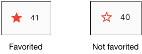
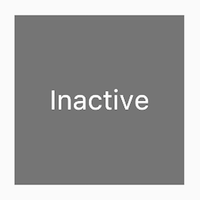

# Adding interactivity to your Flutter app <!-- omit in toc -->

## 目录 <!-- omit in toc -->
- [Stateful and stateless widgets](#stateful-and-stateless-widgets)
- [Creating a stateful widget](#creating-a-stateful-widget)
    - [Step 0: Get ready](#step-0-get-ready)
    - [Step 1: Decide which objet manages the widget‘s state](#step-1-decide-which-objet-manages-the-widgets-state)
    - [Step 2: Subclass StatefulWidget](#step-2-subclass-statefulwidget)
    - [Step 3: Subclass State](#step-3-subclass-state)
    - [Step 4: Plug the stateful widget into the widget tree](#step-4-plug-the-stateful-widget-into-the-widget-tree)
- [Managing state](#managing-state)
    - [The Widget manages its own state](#the-widget-manages-its-own-state)
    - [The parent widget manages the widget's state](#the-parent-widget-manages-the-widgets-state)
    - [A mix-and-match approach](#a-mix-and-match-approach)
- [Other  interactive widgets](#other-interactive-widgets)
    - [Standard widgets](#standard-widgets)
    - [Material Components](#material-components)


这篇教程将会讲述如何修改[上一篇教程的应用](../building-layouts/README.md)来添加用户交互。确切地说，你将通过创建一个自定义的有状态的控件来修改一个图标，让它变成可以点击的。

上一篇教程创建了下图所示的布局：


当应用程序第一次启动的时候，星星是红色实心的，显示这个湖之前被人点过赞。星星右侧的数字显示了41个人对这个湖点过赞。在完成了这个教程之后，点击星星能够移除点赞状态，把实心星星改为只带外边线的星星，并且右侧的数字减一。再次点击这个星星可以重新点赞，星星又会变为实心红色，并且右侧的数字加一。



为了完成这个功能，你需要创建一个单独的自定义的控件，包括星星和点赞计数。当然星星和点赞计数也都是控件。点击星星控件会同时改变这两个控件的状态，所以这个单独的自定义控件可以管理星星和点赞计数这两个控件。

## Stateful and stateless widgets
控件可以是有状态或是无状态的。如果一个控件可以改变，比如当用户和它进行交互时，那么它就是有状态的。

一个无状态的控件是不会改变的。`Icon`、`IconButton`以及`Text`都是无状态控件的例子。无状态的控件继承自`StatelessWidget`。

一个有状态的控件是动态的：比如，当用户和它进行交互或者它接收到数据时，它可以改变外观。`Checkbox`、`Radio`、`Slider`、`InkWell`、`Form`以及`TextField`都是有状态控件的额例子。有状态的控件继承自`StatefulWidget`。

控件的状态存储在`State`对象中，这样可以把控件的状态和外观进行分离。状态对象包含可以改变的值，比如滑块当前的数值，或者复选框是否被选中。当控件的状态改变时，状态对象会调用`setState()`方法，告诉框架去重绘控件。

## Creating a stateful widget

> 重点
> * 一个有状态控件由两个类实现：一个是`StatefulWidget`的子类，另一个是`State`的子类
> * 状态类包含控件的可以改变的状态以及控件的`build()`方法
> * 当控件的状态发生改变，状态对象会调用`setState()`，告诉框架重绘控件。

在这一小节，你会创建一个自定义的有状态控件，用来替代之前的两个无状态的控件——实心的星星以及星星旁边的数字。

实现这个控件需要创建两个类：

* 一个`StatefulWidget`子类，用来定义控件本身
* 一个`State`子类，用来包含控件的状态，同时包含一个`build()`方法

这一小节将讲述如何创建一个叫做`FavoriteWidget`的有状态控件。

#### Step 0: Get ready

如果你已经创建了之前教程的应用程序，可以跳过这一小节，否则请先看之前的教程。

#### Step 1: Decide which objet manages the widget‘s state

一个控件的状态可以用多种方式管理，但是在这个例子中，`FavoriteWidget`控件本身将会管理自己的状态。也就是说，点击星星这个操作不会影响其它的UI。

#### Step 2: Subclass StatefulWidget

`FavoriteWidget`控件管理自己的状态，它需要重载`createState()`来创建状态对象。当框架需要创建控件的时候，会调用`createState()`这个函数。在这个例子中，`createState()`函数返回一个`_FavoriteWidgetState`实例。

```dart
class FavoriteWidget extends StatefulWidget {
  @override
  _FavoriteWidgetState createState() => _FavoriteWidgetState();
}
```

#### Step 3: Subclass State

`_FavoriteWidgetState`类存储了可以在控件生命周期期间改变的数据。当应用程序第一次启动时，界面会展示一个红色的实心星星，表示湖泊被点赞的状态，以及一共的点赞次数。这些值被存储在`_isFavorited`和`_favoriteCount`字段中。

```dart
class _FavoriteWidgetState extends State<FavoriteWidget> {
  bool _isFavorited = true;
  int _favoriteCount = 41;
}
```

这个类同时也定义了`build()`这个函数，在这个函数里会创建一个包含红色的`IconButton`和`Text`的行控件。这里使用`IconButton`而不是使用`Icon`是因为前者有一个`onPressed`的属性可以定义一个点击的回调函数(`_toggleFavorite`)。

```dart
class _FavoriteWidgetState extends State<FavoriteWidget> {
  bool _isFavorited = true;
  int _favoriteCount = 41;

  @override
  Widget build(BuildContext context) {
    return Row(
      mainAxisSize: MainAxisSize.min,
      children: <Widget>[
        Container(
          padding: EdgeInsets.all(0),
          child: IconButton(
            icon: (_isFavorited ? Icon(Icons.star) : Icon(Icons.star_border)),
            color: Colors.red[500],
            onPressed: _toggleFavorite,
          ),
        ),
        SizedBox(
          width: 18,
          child: Container(
            child: Text('$_favoriteCount'),
          ),
        ),
      ],
    );
  }
}
```

> Tip；把`Text`控件放到`SizedBox`里面，并且设置宽度可以避免当数字宽度改变时UI发生跳动。

当`IconButton`被点击时，会调用`_toggleFavorite`函数，这个函数会调用`setState()`函数，这个调用十分关键，因为这会告诉框架这个控件的状态发生了变化，需要重新绘制。

```dart
  void _toggleFavorite() {
    setState(() {
      if (_isFavorited) {
        _favoriteCount -= 1;
        _isFavorited = false;
      } else {
        _favoriteCount += 1;
        _isFavorited = true;
      }
    });
  }
```

#### Step 4: Plug the stateful widget into the widget tree

把自定义的控件添加到应用程序的`build()`方法中：

```dart
    Widget titleSection = Container(
      padding: const EdgeInsets.all(32),
      child: Row(
        children: <Widget>[
          Expanded(
            /*1*/
            child: Column(
              crossAxisAlignment: CrossAxisAlignment.start,
              children: <Widget>[
                /*2*/
                Container(
                  padding: const EdgeInsets.only(bottom: 8),
                  child: Text(
                    'Oeschinen Lake Campground',
                    style: TextStyle(
                      fontWeight: FontWeight.bold,
                    ),
                  ),
                ),
                Text(
                  'Kandersteg, Switzerland',
                  style: TextStyle(
                    color: Colors.grey[500],
                  ),
                ),
              ],
            ),
          ),
          /*3*/
          FavoriteWidget(),
        ],
      ),
    );
```

搞定！

##  Managing state

> 重点
> 管理状态有不同的方式
> 你做为控件的设计者需要选择使用哪种方式
> 如果不确定，可以先在控件的父控件中管理状态

由谁来管理有状态控件的状态呢？控件自己吗？还是控件的父控件？或者说是两个一起管理？还是说让其它对象来管理？答案是——这要看情况。有多种方式可以让你的控件可交互，你，作为控件的设计者，需要决定你的控件如何去使用。下面是一些通用的管理状态的方式

* 控件本身管理自己的状态
* 由父控件管理控件的状态
* 一个混合的方式

如何决定使用哪种方式呢？下面的原则也许可以帮助你做决定：

* 如果状态是用户数据，比如，复选框的选中或是未选中状态，又或者是滑块的当前位置，那么这个状态最好由父控件来管理。
* 如果状态是可视化相关的，比如动画，那么这个状态最好由自己来管理。

如果不确定，可以先在父状态中管理状态。

我将会对不同的方式管理状态举三个简单的例子：`TapboxA`, `TapboxB`, `TapboxC`。这些例子效果都类似——每个都创建一个容器，当容器被点击的时候，会在绿色和灰色之间切换。`_active`这个布尔变量决定颜色：`active`表示绿色，`inactive`表示灰色。



这些例子使用`GestureDetector`来捕捉对容器的手势操作。

#### The Widget manages its own state

有时候，让控件管理自己的状态是有意义的，比如，当内容超出绘制框时，`ListView`会自动进行滚动，大多数开发者使用`ListView`的时候都不想去管理它的滚动状态，所以最好由它自己来管理滚动的位移。

下面是`_TapboxAState`类的实现要点：
* 管理`TapboxA`控件的状态
* 定义了一个`_active`变量来决定容器当前的颜色
* 定义了一个`_handleTap()`函数，当容器被点击时，用来更新`_active`值，以及调用`setState()`函数来更新UI。
* 实现控件所有的交互表现

```dart
// TapboxA manages its own state.

class TapboxA extends StatefulWidget {
  TapboxA({Key key}) : super(key: key);

  @override
  _TapboxAState createState() => _TapboxAState();
}

class _TapboxAState extends State<TapboxA> {
  bool _active = false;

  void _handleTap() {
    setState(() {
      _active = !_active;
    });
  }

  Widget build(BuildContext context) {
    return GestureDector(
      onTap: _handleTap,
      child: Container(
        child: Center(
          child: Text(
            _active ? 'Active' : 'Inactive',
            style: TetStyle(fontSize: 32.0, color: Colors.white),
          ),
        ),
        width: 200.0,
        height: 200.0,
        decoration: BoxDecoration(
          color: _active ? Colors.lightGreen[700] : Colors.grey[600],
        ),
      ),
    );
  }
}

// App
class MyApp extends StatelessWidget {
  @override
  Widget build(BuildContext context) {
    return MaterialApp(
      title: 'Flutter Demo',
      home: Scaffold(
        appBar: AppBar(
          title: Text('Flutter Demo'),
        ),
        body: Center(
          child: TapboxA(),
        ),
      ),
    );
  }
}
```

#### The parent widget manages the widget's state

通常更有意义的是让父控件来管理状态，通知子状态去更新。比如，`IconButton`控件允许你把一个图标当成一个可以点击的按钮。`IconButton`是一个无状态的控件，因为我们决定让它的父控件来管理它的状态。

在下面的例子里，`TapboxB`通过一个回调函数把它的状态导出给父控件，因为`TapboxB`并不管理状态，所以它继承自无状态控件。

下面是`ParentWidgetState`类的实现要点：

* 替`TapboxB`管理`_active`状态
* 实现`_handleTapboxChanged()`函数，当容器被点击时，这个函数会被调用
* 当状态改变时，调用`setState()`来更新UI

下面是`TapboxB`的实现要点：

* 继承无状态控件
* 当检测到点击时，通知父控件

```dart
// ParentWidget manages the state for TapboxB

class ParentWidget extends StatefulWidget {
  @override
  _ParentWidgetState createState() => _ParentWidgetState()l
}

class _ParentWidgetState extends State<ParentWidget> {
  bool _active = false;

  void _handleTapboxChanged(bool newValue) {
    setState(() {
      _active = newValue
    }) ;
  }

  @override
  Widget build(BuildContext context) {
    return Container(
      child: TapboxB(
        active: _active,
        onChanged: _handleTapboxChanged,
      ),
    );
  }
}


class TapboxB extends StatelessWidget {
  TapboxB({Key key, this.active: false, @required this.onChanged}) : super(key: key);

  final bool active;
  final ValueChanged<bool> onChanged;

  void _handleTap() {
    onChanged(!active);
  }

  Widget build(BuildContext context) {
    return GestureDector(
      onTap: _handleTap,
      child: Container(
        child: Center(
          child: Text(
            active ? 'Active' : 'Inactive',
            style: TextStyle(fontSize: 32.0, color: Colors.white),
          ),
        ),
        width: 200.0,
        height: 200.0,
        decoration: BoxDecoration(
          color: active ? Colors.lightGreen[700] : Colors.grey[600],
        ),
      ),
    );
  }
}
```

#### A mix-and-match approach

对于一些控件，一个混合管理状态的方式是最有意义的。在这个场景里，有状态的控件管理部分状态，同时父控件管理其它状态。

在`TapboxC`例子里，点击容器时，一个黑绿色的边框出现在容器周围。点击结束的时候，这个边框消失，并且容器的颜色发生改变。`TapboxC`导出它的`_active`状态给父控件，但是自己管理`_highlight`状态。这个例子有两个状态对象，分别是；`_ParentWidgetState`以及`_TapboxCState`。

下面是`_ParentWidgetState`对象的实现要点：

* 管理`_active`状态
* 实现`_handleTapboxChanged()`方法，当容器被点击时，这个方法被调用。
* 当点击发生，`_active`状态改变时，调用`setState()`方法去更新UI

下面是 `_TapboxCState`的实现要点：

* 管理`_highlight`状态
* `GestureDector`监听所有的点击事件。当用按钮按下时，添加高亮效果，当用户释放按钮时，移除高亮效果。
* 当点击开始、释放或者取消，`_highlight`状态发生改变时，调用`setState()`方法更新UI
* 当点击事件发生时，传递状态信息给父控件，来根据`widget`属性来做特定的动作。

```dart
class ParentWidget extends StatefulWidget {
  @override
  _ParentWidgetState createState() => _ParentWidgetState();
}

class _ParentWidgetState extends State<ParentWidget> {
  setState(() {
    _active = newValue;
  });

  @override
  Widget build(BuildContext context) {
    return Container(
      child: TapboxC(
        active: _active,
        onChanged: _handleTapboxChanged,
      ),
    );
  }
}

// TapboxC
class TapboxC extends StatefulWidget {
  TapboxC({Key key, this.active: false, @required this.onChanged}) : super(key: key);

  final bool active;
  final ValueChanged<bool> onChanged;

  _TapboxCState createState() => _TapboxCState();
}

class _TapboxCState extends State<TapboxC> {
  bool _hightlight = false;

  void _handleTapDown(TapDownDetails details) {
    setState(() {
      _hightlight = true;
    });
  }

  void _handleTapUp(TapUpDetails details) {
    setState(() {
      _hightlight = false;
    });
  }

  void _handleTapCancel() {
    setState(() {
      _hightlight = false;
    });
  }

  void _handleTap() {
    widget.onChanged(!widget.active);
  }

  Widget build(BuildContext context) {
    return GestureDector(
      onTapDown: _handleTapDown,
      onTapUp: _handleTapUp,
      onTap: _handleTap,
      onTapCancel: _handleTapCancel,
      child: Container(
        child: Center(
          child: Text(widget.active ? 'Active' : 'Inactive', 
          style: TextStyle(fontSize: 32.0, color: Colors.white)),
        ),
        width: 200.0,
        height: 200.0,
        decoration: BoxDecoration(
          color: widget.active ? Colors.lightGreen[700] : Color.grey[600],
          border: _highlight ? Border.all(
            color: Colors.teal[700],
            width: 10.0,
          ) : null,
        ),
      ),
    );
  }
}
```

搞定！

## Other  interactive widgets

#### Standard widgets

* Form
* FormField

#### Material Components

* Checkbox
* DropdownButton
* FlatButton
* FloatingActionButon
* IconButton
* Radio
* RaisedButton
* Slider
* Switch
* TextField