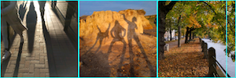

## Layouts in Flutter

`Flutter`布局机制的核心是控件。在`Flutter`中，几乎所有的东西都是控件——布局模型也是控件。你在`Flutter`应用程序里看到的图片、图标和文字都是控件。但是你看不到的也都是控件，像行、列以及网格，这些用来排布、约束以及对其那些看得到的控件。

你通过创建一个组合多个控件的布局来建立一个更复杂的控件。比如，下面的截图显示了3个图标，每个图标下面有一个文字。


第二个截图把布局可视化了，显示了一个包括三列的行，每一列包括一个图标和一个文字。

下面是这个UI的控件树：


上图的大部分应该都如你预期，但是你可能会对标记为粉红色的`container`感到疑惑。容器是一个可以允许你定制化它的子控件的控件。当你想要添`padding`、`margins`、`borders`或者背景颜色等特性时，就需要使用容器控件。

在这个例子中，每个文字控件被放置于容器控件中，以添加`margins`。每个行控件也被放置于容器中，以在行的周围添加`padding`。

这个例子中剩下的UI通过属性来控制。通过`color`属性来设置图标的颜色。使用`Text.style`属性来设置文字的字体和颜色、高度等等。列和行控件有可以让你指定如何让其子控件水平和垂直对齐，以及让子控件占据多大的空间的属性。

## Lay out a widget

如何布局单个控件呢？这个小节通过一个简单的应用程序来展示。

#### 第一步，选择一个布局控件

根据你想如何对齐或者约束展示控件去选取一个布局控件，这个例子使用`Center`控件，这个控件可以把内容在水平和垂直方向上居中。

#### 第二步，创建一个展示控件

比如，创建一个`Text`控件

```dart
Text('Hello World'),
```

创建一个`Image`控件

```dart
Image.asset(
  'images/lake.jpg',
  fit: BoxFit.cover,
),
```

创建一个`Icon`控件

```dart
Icon(
  Icons.star,
  color: Colors.red[500],
),
```

#### 第三步，把展示控件添加到布局控件中

每个布局控件都有下面的属性：

* 如果控件只有一个子控件的话，比如`Center`和`Container`，就会包含一个`child`属性

* 如果控件有多个子控件的话，比如`Row`、`Column`、`ListView`或者`Stack`,就会包含一个`children`属性

添加`Text`控件到`Center`控件中：

```dart
Center(
  child: Text('Hello World'),
),
```

#### 第四步，添加布局控件到页面中

一个`Flutter`应用程序本身就是一个控件，绝大多数控件都有一个`build()`方法。通过在应用程序的`build()`方法中初始化并返回一个控件就可以展示该控件。

##### Material apps

对于`Material`程序，你可以使用`Scaffold`这个控件；脚手架控件提供了一个默认的`banner`(标题）、`background color`，并且有可以添加`drawers`（抽屉）、`snack bars`以及`bottom sheets`的`API`。现在你可以把`center`控件直接添加到主页的`body`属性上。

```dart
class MyApp extends StatelessWidget {
  @override
  Widget build(BuildContext context) {
    return MaterialApp(
      title: 'Flutter layout demo',
      home: Scaffold(
        appBar: AppBar(
          title: Text('Flutter layout demo'),
        ),
        body: Center(
          child: Text('Hello World'),
        ),
      ),
    );
  }
}
```

##### Non-Material apps

对于非`Material`程序，你可以添加`Center`控件到应用程序的`build()`方法中：

```dart
class MyApp extends StatelessWidget {
  @override
  Widget build(BuildContext context) {
    return Container(
      decoration: BoxDecoration(color: Colors.white),
      child: Center(
        child: Text(
          'Hello World',
          textDirection: TextDirection.ltr,
          style: TextStyle(
            fontSize: 32,
            color: Colors.black87,
          ),
        ),
      ),
    );
  }
}
```
非`Material`程序默认不包括一个`AppBar`，标题或者背景颜色。如果你想要包括这些，就得自己创建。

## Lay out multiple widgets vertically and horizontally

使用得最多的布局方式之一是把控件水平或垂直分布。你可以使用行控件和列控件实现。

在`Flutter`中，可以通过在`Row`或者`Column`控件内添加一个子控件列表来构造一行或一列。并且，子控件还可以是行或者列控件。下面的例子显示了如何在行和列中内嵌行和列。

这个布局被组织为一行，行控件包括两个子控件：一个位于左侧的列控件，以及位于右侧的图片控件。


位于左侧的列控件又由内嵌的行和列组成。


> 注意：行和列控件是水平和垂直布局的基础控件——这些底层的控件允许最大化的自定义。`Flutter`同时也提供了特化的，高层级的控件。比如，除了行控件，你可能更倾向于`ListTile`控件，后者带有前缀和后缀的图标，以及最多三行文字等属性；除了列控件，你可能更倾向于`ListView`控件，一个当列的内容溢出屏幕可以自动滚动的控件。

## Aligning widgets

你可以使用`mainAxisAlignment`和`crossAxisAlignment`属性来控制行和列控件如何对齐它们内部的子控件。对于行控件来说，`main axis`是水平的，`cross axis`是垂直的。对于列控件来说，`main axis`是垂直的，`cross axis`是水平的。


`mainAxisAlignment`和`CrossAxisAlignmeng`提供了各种常量来控制对齐。

> 注意：当你往项目里添加图片的时候，需要更新`pubspec.yaml`。这个例子使用`Image.asset`来展示图片。如果你通过`Image.network`方式来访问在线图片则不需这么做。

在下面的例子中，3个图片都是100像素宽。绘制区域（在这个例子中是全屏幕）的宽度大于300个像素，所以设置`main axis`对齐为`spaceEvenly`可以把多余的空间均匀地分配到图片前后以及图片之间。

```dart
Row(
  mainAxisAlignment: MainAxisAlignment.spaceEvenly,
  children: [
    Image.asset('images/pic1.jpg'),
    Image.asset('images/pic2.jpg'),
    Image.asset('images/pic3.jpg'),
  ],
);
```


列布局和行布局的作用方式相同。下面的例子展示了排成一列的三个图片，每个都是100像素高。绘制区域的高度大于300个像素，因此设置`main axis`为`spaceEvenly`可以把多余的控件均匀地分配到图片之间、图片顶部以及图片底部。

```dart
Column(
  mainAxisAlignment: MainAxisAlignment.spaceEvenly,
  children: [
    Image.asset('images/pic1.jpg'),
    Image.asset('images/pic2.jpg'),
    Image.asset('images/pic3.jpg'),
  ],
);
```


## Sizing widgets

当一个布局大小超过了设备大小，超过的边上会出现一个黄黑相间的条带纹理。下面是一个行宽度太大的例子：


控件可以使用`Expanded`控件来缩放到行或列控件中。为了修复上面的例子中相对于绘制区域行太宽的问题，可以把每个图片包裹在一个`Expanded`控件内部：

```dart
Row(
  crossAxisAlignment: CrossAxisAlignment.center,
  children: [
    Expanded(
      child: Image.asset('images/pic1.jpg'),
    ),
    Expanded(
      child: Image.asset('images/pic2.jpg'),
    ),
    Expanded(
      child: Image.asset('images/pic3.jpg'),
    ),
  ],
);
```


也许你想要一个控件占据的空间是相邻控件的两倍，那么可以使用`Expanded`控件的`flex`属性，对于每个子控件，`flex`的数值决定了它占据控件的大小。默认的大小为1.下面的代码设置中间的图片的`flex factor`为2:

```dart
Row(
  crossAxisAlignment: CrossAxisAlignment.center,
  children: [
    Expanded(
      child: Image.asset('images/pic1.jpg'),
    ),
    Expanded(
      flex: 2,
      child: Image.asset('images/pic2.jpg'),
    ),
    Expanded(
      child: Image.asset('images/pic3.jpg'),
    ),
  ],
);`
```


## Packing widgets

默认情况下，一行或者一列会在`main axis`占据尽可能多的空间，但是如果你想让子控件靠近些，可以设置`mainAxisSize`属性为`MainAxisSize.min`。下面的例子使用这个属性把星星图标靠在一起。

```dart
Row(
  mainAxisSize: MainAxisSize.min,
  children: [
    Icon(Icons.star, color: Colors.green[500]),
    Icon(Icons.star, color: Colors.green[500]),
    Icon(Icons.star, color: Colors.green[500]),
    Icon(Icons.star, color: Colors.black),
    Icon(Icons.star, color: Colors.black),
  ],
)
```


## Nesting rows and columns

布局框架允许在行和列控件中内嵌行和列控件，内嵌的深度是任意的。下面看一下下图中红框里的布局的代码：


红框的区域使用两个行控件进行实现。评分行包含五个星星以及评价数量。图标行包括三个列控件，每个列控件又由图标和文字组成。

下面是评分行的控件树：


`ratings`变量创建了一个行控件，包含了一个包含5个星星图标的更小的行，以及一个文字控件：

```dart
var stars = Row(
  mainAxisSize: MainAxisSize.min,
  children: [
    Icon(Icons.star, color: Colors.green[500]),
    Icon(Icons.star, color: Colors.green[500]),
    Icon(Icons.star, color: Colors.green[500]),
    Icon(Icons.star, color: Colors.black),
    Icon(Icons.star, color: Colors.black),
  ],
);

final ratings = Container(
  padding: EdgeInsets.all(20),
  child: Row(
    mainAxisAlignment: MainAxisAlignment.spaceEvenly,
    children: [
      stars,
      Text(
        '170 Reviews',
        style: TextStyle(
          color: Color.black,
          fontWeight: FontWeight.w800,
          fontFamily: 'Roboto',
          fontSize: 20,
        ),
      ),
    ],
  ),
);
```

> Tip: 为了最小化布局嵌套引起的视觉混乱，可以使用变量和函数来实现单独的UI。

位于评分行下面的图标行，包括3列，每一列包含一个图标以及两行文字，下面是图标行的控件树：


`iconList`变量定义了图标行：

```dart
final descTextStyle = TextStyle(
  color: Colors.black,
  fontWeight: FontWeight.w800,
  fontFamily: 'Roboto',
  letterSpacing: 0.5,
  fontSize: 18,
  height: 2,
);

// DefaultTextStyle.merge() allows you to create a default text style that is inherited by its child and all subsequent children.
final iconList = DefaultTextStyle.merge(
  style: descTextStyle,
  child: Container(
    padding: EdgeInsets.all(20),
    child: Row(
      mainAxisAlignment: MainAxisAlignment.spaceEvenly,
      children: [
        Column(
          children: [
            Icon(Icons.kitchen, color: Color.green[500]),
            Text('PREP:'),
            Text('25 min'),
          ],
        ),
         Column(
          children: [
            Icon(Icons.timer, color: Color.green[500]),
            Text('COOK:'),
            Text('1 hr'),
          ],
        ),
         Column(
          children: [
            Icon(Icons.restaurant, color: Color.green[500]),
            Text('FEEDS:'),
            Text('4-6'),
          ],
        ),
      ],
    ),
  ),
);
```
下面代码的`leftColumn`变量包含了评分行以及图标行，同时也包含了标题和文字；

```dart
final leftColumn = Container(
  padding: EdgeInsets.fromLTRB(20, 30, 20, 20),
  child: Column(
    children: [
      titleText,
      subTitle,
      ratings,
      iconList,
    ],
  ),
);
```

下面是包含右边图片的所有代码：

```dart
body: Center(
  child: Container(
    margin: EdgeInsets.frmLTRB(0, 40, 0, 30),
    height: 600,
    child: Card(
      child: Row(
        crossAxisAlignment: CrossAxisAxisAlignment: CrossAxisAlignment.start,
        children: [
          Container(
            width: 440,
            child: leftColumn,
          ),
          mainImage,
        ],
      ),
    ),
  ),
),
```

## Common layout widgets

下面的控件分为两大类：标准控件以及特化控件。标准控件来自于控件库，所有应用程序都可以使用，而特化控件来自于`Material`控件库，只有`Material`应用才可以使用。

#### Standard widgets

* `Container`: 对控件添加`padding`、`margins`、`borders`、`background color`或其它装饰。
* `GridView`: 布局控件为可滚动网格
* `ListView`: 布局控件为可滚动列表
* `Stack`: 堆叠控件

#### Material widgets

* `Card`: 添加相关的信息到一个带圆角和阴影的框中
* `ListTile`: 将最多3行文字，一个可选的前置和后置图标组和成一个行。

#### Container

##### 总结
* 添加`padding,margins,borders`
* 改变背景颜色或背景图片
* 包含一个单独的子控件，这个子控件可以是行，列甚至是一个控件树的根节点


##### 例子

下面的布局包含一个列控件，列控件由两个行控件组成，每个行控件又由两个图片组成。一个容器控件用来改变背景颜色为浅灰色。

```dart
Widget _buildImagecolumn() => Container(
  decoration: BoxDecoration(
    color: Colors.black26,
  ),
  child: Column(
    children: [
      _buildImageRow(1),
      _buildImageRow(3),
    ],
  ),
);
```


一个容器同时也用于每个图片上，去添加一个圆角矩形和`margins`:

```dart
Widget _builddecoratedImage(int imageIndex) => Expanded(
  child: Container(
    decoration: BoxDecoration(
      border: Border.all(width: 10, color: Colors.black38),
      borderRadius: const BorderRadius.all(const Radius.circular),
    ),
    margin: const EdgeInsets.all(4),
    child: Image.asset('images/pic$imageIndex.jpg'),
  ),
);

Widget _buildImageRow(int imageIndex) => Row(
  children: [
    _buildDecoratedImage(imageIndex),
    _buildDecoratedImage(imageIndex + 1),
  ],
);
```

#### GridView

`GridView`可以把控件布局为一个二维的列表。该控件提供了两种预定的列表风格，或者你也可以创建自己的风格。当控件检测到其内容太长以至于覆盖不了整个视图，就湖自动滚动。

##### Summary

* 布局控件为网格
* 检测列内容是否超出视图范围，若超出会自动提供滚动条
* 可以使用自己创建的网格，也可以使用下面两种提供的网格之一：
  * `GridView.count`允许指定列数
  * `GridView.extent`允许指定一个元素的最大像素宽度

##### Examples


```dart
Widget _buildGrid() => GridView.extent(
  maxCrossAxisExtent: 150,
  padding: const EdgeInsets.all(4),
  mainAxisSpacing: 4,
  crossAxisSpacing: 4,
  children: _buildGridTileList(30),
);

// The images are saved with names pic0.jpg, pic1.jpg, ...pic29.jpg
// The List.generate() constructor allows an easy way to create
// a list when objects have a predictable naming pattern
List<Container> _buildGridTileList(int count) => List.generate(
  count, (i) => Container(child: Image.asset('images/pic$i.jpg'))
);
```

#### ListView

`ListView`类似于列控件，可以自动提供滚动条。

##### Summary

* 一个特化的列控件来布局一个控件列表
* 可以水平或者垂直进行布局
* 自动检测内容超出视图，并提供滚动条
* 相比于列控件可配置的属性较少，但是更易于使用且支持滚动

##### Examples


上图使用`ListView`来展示营业地点，营业地点是用`ListTile`展示的。一个`Divider`控件用来分隔开剧院和餐馆。


上图使用`ListView`来展示`Material Design`的调色板。

```dart
Widget _buildList() => ListView(
      children: [
        _tile('CineArts at the Empire', '85 W Portal Ave', Icons.theaters),
        _tile('The Castro Theater', '429 Castro St', Icons.theaters),
        _tile('Alamo Drafthouse Cinema', '2550 Mission St', Icons.theaters),
        _tile('Roxie Theater', '3117 16th St', Icons.theaters),
        _tile('United Artists Stonestown Twin', '501 Buckingham Way',
            Icons.theaters),
        _tile('AMC Metreon 16', '135 4th St #3000', Icons.theaters),
        Divider(),
        _tile('Kescaped_code#39;s Kitchen', '757 Monterey Blvd', Icons.restaurant),
        _tile('Emmyescaped_code#39;s Restaurant', '1923 Ocean Ave', Icons.restaurant),
        _tile(
            'Chaiya Thai Restaurant', '272 Claremont Blvd', Icons.restaurant),
        _tile('La Ciccia', '291 30th St', Icons.restaurant),
      ],
    );

ListTile _tile(String title, String subtitle, IconData icon) => ListTile(
      title: Text(title,
          style: TextStyle(
            fontWeight: FontWeight.w500,
            fontSize: 20,
          )),
      subtitle: Text(subtitle),
      leading: Icon(
        icon,
        color: Colors.blue[500],
      ),
    );
```

#### Stack

使用栈控件来布局互相覆盖的控件——通常应用于图片上。控件可以完全或者部分重叠在其它控件之上。

##### Summary

* 用于覆盖于其它控件之上的控件
* 子控件列表中的第一个控件是基控件，其余的控件会重叠在基控件之上
* 栈控件的内容不可以滚动
* 可以选择将子控件超出视图的部分进行裁剪

##### Examples


使用栈控件将一个容器控件（在灰色背景中展示文字）叠放在一个圆形的个人图片上。栈控件使用`alignment`属性来指定文字的偏移。


上面的例子使用栈控件将一个渐变应用到图片的上方，使得工具栏可以和图片分开。

```dart
Wdiget _buildStack() => Stack(
  alignment: const Alignment(0.6, 0.6),
  children: [
    CircleAvatar(
      backgroundImage: AssetImage('images/pic.jpg'),
      radius: 100,
    ),
    Container(
      decoration: BoxDecoration(
        color: Color.black45,
      ),
      child: Text(
        'Mia B',
        style: TextStyle(
          fontSize: 20,
          fontWeight: FontWeight.bold,
          color: Color.white,
        ),
      ),
    ),
  ],
);
```

#### Card

`Card`控件来自于`Material`控件库，用于将相关的信息进行组合。通常和`ListTile`控件一起使用。`Card`控件只有一个单独的子控件，但是子控件可以是行、列、网格或者其它支持多个子控件的控件。默认情况下，`Card`控件的大小为0x0像素。可以通过`SizeBox`控件去约束卡片的大小。

在`Flutter`中，卡片控件带一点圆角和一个下沉的阴影，因此有一个3D的效果。改变卡片的`elevation`属性可以控制下沉阴影的效果。比如，设置该值为24，剋使得阴影的效果变得十分显著。

##### Summary

* 实现了`Material`的风格
* 用于组合关联信息
* 接收单独的子控件，但是子控件可以是行、列、网格或者其它支持多个子控件的控件
* 带一点圆角和一个下沉的阴影
* 内容无法滚动

##### Examples


上面的卡片控件包含3个`ListTile`控件，并通过`SizedBox`控件进行包裹。

```dart
Widget _buildCard() => SizedBox(
  height: 210,
  child: Card(
    child: Column(
      children: [
        ListTile(
          title: Text('1625 Main Street',
          style: TextStyle(fontWeight: FontWeight.w500)),
          subtitle: Text('My City, CA 99984'),
          leading: Icon(
            Icons.restaurant_menu,
            color: Colors.blue[500],
          ),
        ),
        Divider(),
        ListTile(
          title: Text('(408) 555-1212',
          style: TextStyle(fontWeight: FontWeight.w500)),
          leading: Icon(
            Icons.contact_phone,
            color: Colors.blue[500],
          ),
        ),
        ListTile(
          title: Text('costa@example.com',
          leading: Icon(
            Icons.contact_email,
            color: Colors.blue[500],
          ),
        ),
      ],
    ),
  ),
);
```

#### ListTile

##### Summary

* 特化的行控件，包含最多三行文字以及可选的图标
* 相比于行控件可配置项更少，但是更容易使用
* 来自于`Material`控件库

##### Examples


上面的卡片控件包含3个`ListTile`控件，并通过`SizedBox`控件进行包裹。